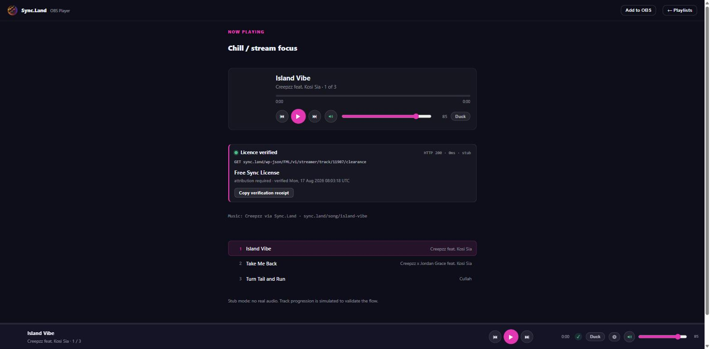
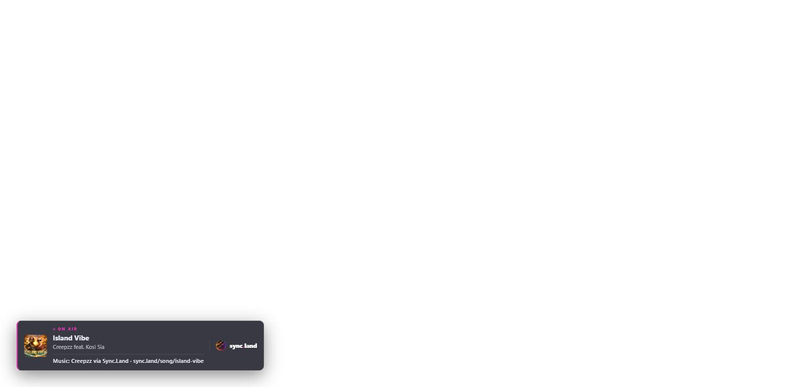

<p align="center">
  <a href="https://sync.land">
    
  </a>
</p>

<h1 align="center">Sync.Land OBS Player</h1>

<p align="center">
  <strong>Licensed music for live streams, with the licence checked on air.</strong><br>
  Play your Sync.Land playlists inside OBS Studio, verify every track's sync licence<br>
  against the public API before it plays, and render the required credit automatically.
</p>

<p align="center">
  
  
  
  
</p>

<p align="center">
  <a href="https://sync.land/dock/"><b>Live app</b></a> &nbsp;·&nbsp;
  <a href="#add-to-obs">Add to OBS</a> &nbsp;·&nbsp;
  <a href="docs/streamer-setup.md">Setup guide</a> &nbsp;·&nbsp;
  <a href="docs/api.md">API reference</a> &nbsp;·&nbsp;
  <a href="https://sync.land/free-sync-license/">SLFS-v1</a>
</p>

---

<p align="center">
  
  <br>
  <em>The dock puts the verification on screen: endpoint, status, latency, verdict.</em>
</p>

Runs as either, and normally both at once:

| Mode | What it is | What it does |
|---|---|---|
| **Custom Browser Dock** | A panel inside the OBS interface | The control surface: playlists, transport, licence verification, settings |
| **Browser Source** | A transparent layer on your scene | The on-air attribution lower third — and the mixer channel your music plays through |

<p align="center">
  
  <br>
  <em>The overlay renders the credit SLFS-v1 requires, and changes with the track.</em>
</p>

## Contents

- [Why this exists](#why-this-exists)
- [How it works](#how-it-works)
- [Architecture: /dock vs /streamer](#architecture-dock-vs-streamer)
- [Add to OBS](#add-to-obs)
- [Developer setup](#developer-setup)
- [Self-hosted deployments](#self-hosted-deployments)
- [Troubleshooting](#troubleshooting)
- [API endpoints hit](#api-endpoints-hit)
- [Licensing model](#licensing-model)
- [Roadmap](#roadmap)

## Why this exists

Streamers on Twitch and YouTube Live constantly get their VODs muted or claimed for using unlicensed music. Sync.Land licenses independent music under the [Sync.Land Free Sync License (SLFS-v1)](https://sync.land/free-sync-license/), which explicitly permits creator-scale live-stream use with attribution. This player is the tool that turns those licenses into practice: your playlist plays on stream, the required attribution string shows on air, and every play is logged for the license audit trail.

## How it works

1. Streamer generates a Personal Access Token (PAT) at `sync.land/account/tokens/`.
2. Streamer pastes the PAT into the player and picks one of their saved playlists.
3. Player fetches per-track license clearance from Sync.Land before each track plays.
4. Player streams the audio directly from Sync.Land's object storage.
5. Player renders the required attribution string as an overlay (Browser Source mode).
6. Each play is logged to Sync.Land's analytics for the licensing audit trail.

## Architecture: /dock vs /streamer

Two URL prefixes, two very different things — worth stating clearly since they get confused.

| Path | What it is | Who serves it | Who calls it |
|---|---|---|---|
| `sync.land/dock/` | The **frontend SPA** — this repo's Vite build. Loaded as a URL inside OBS. | Static host (currently DreamHost nginx). | The OBS browser (dock or source). |
| `sync.land/wp-json/FML/v1/streamer/*` | The **REST API** — PAT-authenticated JSON endpoints for playlists, per-track clearance, and play logging. | The `syncland-streamer-api.php` mu-plugin on the Sync.Land WordPress node. | The SPA above (browser → API). |

The SPA at `/dock/` is a static bundle — it doesn't run on the WordPress node, and it doesn't hold any secrets. It gets your PAT from a form input (or a `?token=...` URL), stores it in `localStorage`, and uses it as a Bearer credential when calling the `/streamer/*` API.

The `/streamer/*` API is the security boundary. It validates the PAT against a SHA-256 hash in `wp_streamer_tokens`, resolves the caller to a WordPress user, and returns only that user's playlists / their songs' clearance. Every response is CORS-open (any origin holding a valid PAT is legitimate) so the SPA can run from `sync.land/dock/`, `localhost:5173` during dev, or a self-hosted mirror anywhere.

## Add to OBS

**As a Custom Browser Dock** (control panel):
1. In OBS: **Docks → Custom Browser Docks**
2. Add a new dock:
   - **Dock Name:** Sync.Land Player
   - **URL:** `https://sync.land/dock/`
3. Apply — the player appears as a panel you can drag into any OBS layout.

**As a Browser Source** (attribution overlay on your scene):
1. In OBS: **Sources → + → Browser**
2. Configure:
   - **URL:** `https://sync.land/dock/?mode=overlay`
   - **Width:** 1920
   - **Height:** 300 (or wherever you want the attribution row)
   - **Custom CSS:** leave blank (the app renders its own transparent background)
   - **Uncheck "Refresh browser when scene becomes active"** — left on, the overlay forgets what's playing every time you cut to that scene
3. Place on your scene wherever the attribution should appear.

**The overlay URL carries no token, and must not.** The dock drives it over a
`BroadcastChannel` on the shared `sync.land` origin, so the overlay never calls
the API and never needs a credential. OBS shows a source's URL in its properties
dialog, which is a bad place to keep a working key to your catalogue — earlier
versions of this document told you to append `&token=<your-PAT>` here, and that
advice was wrong from v0.2.0 onward.

You'll use both together: the dock to control what plays, the Browser Source to show the attribution on stream.

### Why the overlay matters for audio, not just attribution

A Custom Browser Dock is OBS *interface*, not a Source. Its audio goes to your
system output device and never reaches the OBS mixer, so the only way to get it
on stream is a Desktop Audio capture that also carries your notifications and
every other system sound, with no per-source fader, filter or monitoring.

A Browser Source gets a real mixer channel. So when the overlay is present it
owns the `<audio>` element and the dock drives playback remotely, giving the
music its own fader. Only one context ever holds the source; if you hear a
doubled, slightly phase-offset copy of the track, both are playing and the
handover didn't take.

## Developer setup

```bash
git clone https://github.com/Awen-online/syncland-obs-player.git
cd syncland-obs-player
npm install
npm run dev
```

Dev server runs on `http://localhost:5173`.

By default it hits production (`https://sync.land/wp-json/FML/v1`). Point it at a local Sync.Land backend via `.env.local`:

```bash
# .env.local
VITE_SYNCLAND_API=http://sync.local/wp-json/FML/v1
```

You'll need a PAT from wherever your `VITE_SYNCLAND_API` points — mint one at `/account/tokens/` on that host. Any non-empty token is accepted in `?stub=1` mode if you want to click through the UI without a backend.

### Build

```bash
npm run build
```

Static bundle emits to `dist/`. Deploy that directory to `sync.land/dock/` (or any HTTPS location — OBS Browser Sources accept any HTTPS URL).

## Self-hosted deployments

The SPA is fully static and holds no secrets — mirror it anywhere. Two things to check when hosting somewhere other than `sync.land/dock/`:

1. **CORS.** The `syncland-streamer-api.php` mu-plugin reflects any request Origin, so cross-origin calls from your host will succeed. Confirm with a preflight:
   ```bash
   curl -si -X OPTIONS -H "Origin: https://your-host.example" \
        -H "Access-Control-Request-Method: GET" \
        -H "Access-Control-Request-Headers: authorization" \
        https://sync.land/wp-json/FML/v1/streamer/me
   ```
   You should see `Access-Control-Allow-Origin: https://your-host.example` in the response.

2. **HTTPS.** OBS Browser Sources refuse mixed-content — if your dock URL is `http://`, you can't play the `https://` audio URLs the API returns. Serve `/dock/` behind TLS.

## Troubleshooting

**"That token didn't work"** — the PAT is invalid, revoked, or expired. Mint a new one at `sync.land/account/tokens/` and paste it again. If the whole `/streamer/*` API is unreachable (network tab shows `Failed to fetch`), it's probably CORS on a self-host — see above.

**Track shows "Blocked"** — the license state changed since you built the playlist. Common reasons: `no_license` (song was deleted), `artist_removed` (artist unpublished their profile), `artist_paused` (artist explicitly paused licensing on this track). The player skips to the next track automatically.

**Audio doesn't play, no error** — you are almost certainly running the dock alone. A Custom Browser Dock is OBS *interface*, not a Source: its audio goes to your system output and never reaches the mixer. Add the overlay as a Browser Source and it takes over playback on a real mixer channel. (Earlier versions of this file said to right-click the source and set **Audio Monitoring** — a dock is not a source and has no such menu.)

**Doubled or phase-offset audio** — both the dock and the overlay are holding the audio element. Only one context may play at a time; the handover happens on the overlay's first heartbeat and reverts if beacons stop for five seconds. Reload the overlay source.

**Cover art missing** — songs without a WordPress featured image return `cover_url: ""` and the player falls back to a magenta/blue gradient placeholder. To add a cover, upload one at `sync.land/wp-admin/post.php?post=<song_id>&action=edit → Featured Image`.

**Play logs missing from analytics** — the `POST /streamer/track/{id}/played` call is fire-and-forget; it can fail silently. Check DevTools → Network → filter `/played` to see the response.

## API endpoints hit

All hit the Sync.Land REST API under `/wp-json/FML/v1/streamer/*`. Full spec: [docs/api.md](docs/api.md).

| Method | Endpoint | Purpose |
|---|---|---|
| GET | `/streamer/me` | Sanity-check the PAT, return user_id + display_name + artist_ids. |
| GET | `/streamer/playlists` | List the streamer's saved playlists with track lists, cover art, and per-track duration. |
| GET | `/streamer/track/{song_id}/clearance` | Per-track license check + stream URL + attribution string + album + duration + cover. |
| POST | `/streamer/track/{song_id}/played` | Log a play event to the analytics audit trail (fire-and-forget). |

PAT format: `sk_syncland_{40 chars}` (53 chars total). Stored server-side as SHA-256 hex; the plaintext is shown exactly once at creation.

## Licensing model

Every track played through this player is deemed to be issued under the **Sync.Land Free Sync License, version SLFS-v1.0-2026-07-11** for the streamer's use, under the "user-generated content on ad-supported platforms" clause (Section 2 of SLFS-v1). Attribution is required and rendered automatically. Full license text: <https://sync.land/free-sync-license/>.

If the streamer has upgraded to a **Commercial Sync** license for specific tracks, the clearance response tells the player so and it renders no attribution requirement for those tracks.

## Roadmap

**Shipped**

- **v0.1** — PAT auth, playlist load, per-track clearance, attribution overlay.
- **v0.2** — **← current.** Audio moved onto a real OBS mixer channel via the overlay; persistent playback that survives navigation; licence verification made visible on screen with a copyable receipt; overlay lower third with five themes; settings screen; in-app OBS setup panel; fade in/out with talk-over duck.

**Planned**

- **v0.3** — OAuth2 / PKCE auth flow, replacing the PAT for smoother connection.
- **v0.4** — Real-time view-cap counter: the dock warns as a track approaches the SLFS-v1 view cap and offers an upgrade.
- **v0.5** — Multi-playlist queue and cross-playlist shuffle.
- **v0.6** — Streamlabs OBS + XSplit compatibility pass. Both accept the same browser URL, so this is expected to work already; it is untested.
- **v1.0** — Public release and integration marketing.

### Known limits in v0.2.0

- Overlay audio handover is verified by construction and in a browser, but **not yet end to end inside OBS with a live token**.
- Loudness normalisation ships **off by default**, and is RMS rather than LUFS.
- Stream URLs are unsigned object-storage links, and now travel to the overlay context as well as the dock.

## License

Apache License 2.0. See [LICENSE](LICENSE). The Sync.Land brand, music catalog, and API access are governed separately by Sync.Land's [Terms of Use](https://sync.land/terms-and-conditions/) and [Free Sync License](https://sync.land/free-sync-license/).

## Related

- [Sync.Land](https://sync.land) — the music licensing marketplace this player streams from.
- [Awen-online/sync.land](https://github.com/Awen-online/sync.land) — Sync.Land's public Catalyst-submission repo (API spec, license docs, marketplace open-core).
